<div align="center">

# SACI PeReRe

Sistema de Auxílio à Comunicação Interativa para Perguntas e Respostas Recorrentes
    
<!--  -->

[](https://github.com/Softawii/saci-perere/actions/workflows/test-api.yaml)
[](https://github.com/Softawii/saci-perere/actions/workflows/build-discord-bot.yaml)
</div>

## Resumo

<div align="justify">

Nos últimos anos, o crescimento exponencial da internet revolucionou a forma como as pessoas interagem, resultando em um aumento significativo no número de usuários. A disseminação rápida de informações e o surgimento de novas formas de comunicação são características marcantes dessa transformação tecnológica. Nesse cenário, os chatbots desempenham um papel relevante ao fornecer respostas rápidas. Ao considerarmos o contexto educacional, especialmente em universidades públicas com grande ingresso de alunos, o desenvolvimento de um sistema de chatbot personalizado pode aliviar a carga de trabalho dessas instituições ao oferecer suporte constante aos estudantes e fornecer informações sobre cursos, processos seletivos, calendário acadêmico e outros tópicos relevantes. Este trabalho propõe desenvolver um sistema de gerenciamento de perguntas e respostas para que possam ser consumidos por um modelo de inteligência artificial que ficará responsável por responder perguntas frequentes. Dessa forma, os profissionais teriam mais tempo para questões complexas, enquanto as dúvidas comuns seriam prontamente atendidas pelo chatbot, contribuindo para aprimorar a experiência acadêmica como um todo.

</div>

## Abstract

<div align="justify">
    
In recent years, the exponential growth of the internet has revolutionized the way people interact, resulting in a significant increase in the number of users. The rapid dissemination of information and the emergence of new forms of communication are striking features of this technological transformation. In this scenario, chatbots play a relevant role by providing quick responses. When considering the educational context, especially in public universities with a large influx of students, the development of a personalized chatbot system can alleviate the workload of these institutions by offering constant support to students and providing information about courses, admission processes, academic calendars and other relevant topics. This work aims to develop a question and answer management system that can be consumed by an artificial intelligence model responsible for answering frequently asked questions. In this way, professionals would have more time for complex issues, while common doubts would be promptly addressed by the chatbot, contributing to enhancing the overall academic experience.

</div>

------------

# Módulos

- Sistema Administrativo
    - [Front-end](/front)
    - [API](/front-api)
- [API do Modelo](/model)
- [Bot para Discord](/discord-bot)

> Desenvolvido e testado no Ubuntu 22.04

--------

# Proposta

<div align="justify">

Este trabalho propõe a criação do SACI PeReRe (Sistema de Auxílio à Comunicação
Interativa para Perguntas e Respostas Recorrentes). Será desenvolvido um
sistema administrativo Web para o cadastro de perguntas e respostas, bem como um
modelo de redes neurais para identificar automaticamente as respostas às perguntas.
Além disso, será implementado um bot para o Discord que permitirá que os usuários
finais façam perguntas e que essas sejam processadas pelo modelo de rede neural.
Tanto o sistema administrativo Web quanto o sistema do modelo de redes neurais
acessarão o mesmo banco de dados, conforme é possível observar na figura 3.1.

<figure align="center">
    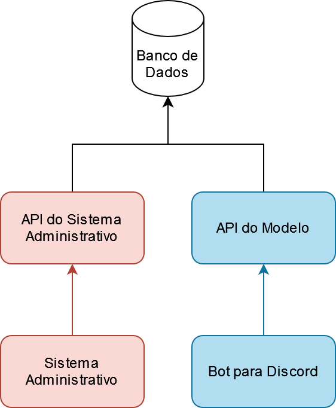
    <figcaption>Figura 3.1: Arquitetura do sistema</figcaption>
</figure>

</div>

## Sistema Administrativo Web

<div align="justify">

O sistema administrativo Web será o espaço destinado aos servidores públicos das
universidades para cadastrar perguntas e respostas. Para possibilitar a utilização do
sistema por diferentes departamentos, cursos e/ou instituições, será implementado
um sistema hierárquico de cadastro, representado pela figura 3.2. Esse sistema
hierárquico incluirá tópicos, dentro de cada tópico haverá categorias e, por fim,
dentro de cada categoria estarão as perguntas, acompanhadas de suas respectivas
respostas.

<figure align="center">
    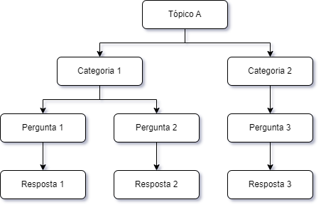
    <figcaption>Figura 3.2: Hierarquia das perguntas</figcaption>
</figure>

<figure align="center">
    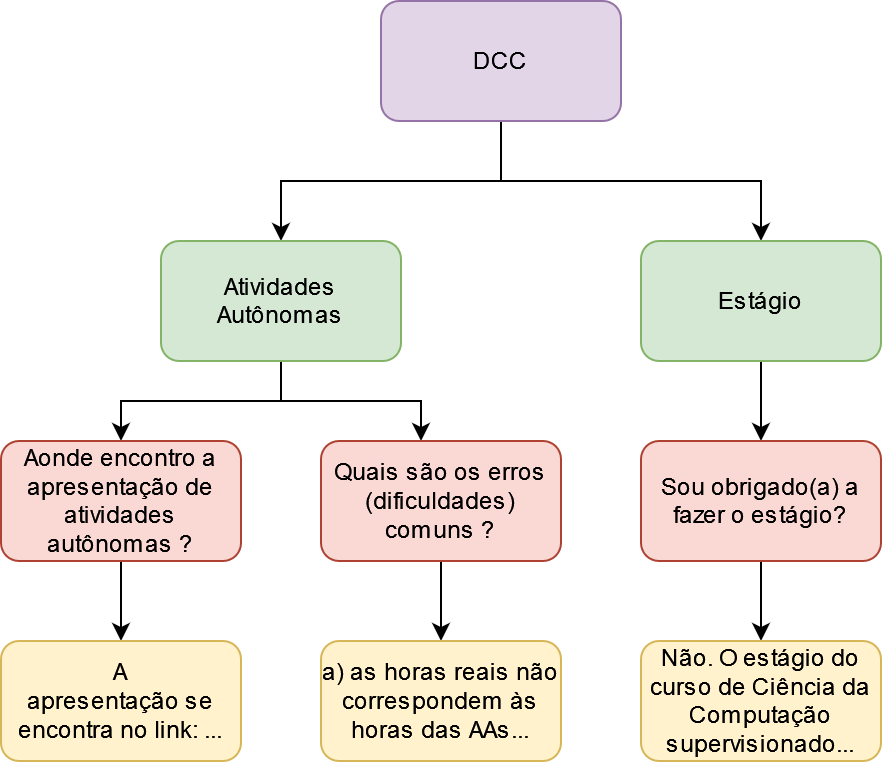
    <figcaption>Exemplo real da hierarquia das perguntas</figcaption>
</figure>

Esse sistema também terá um painel com estatísticas fornecidas a partir de
feedback dos usuários sobre as respostas que serão fornecidas pelo modelo de redes
neurais. Com essas estatísticas será possível identificar a precisão e eficácia do modelo
de redes neurais, além de permitir que o usuário do sistema administrativo possa
identificar e reformular as perguntas de maneira que melhore a precisão do modelo.

Para auxiliar os usuários do sistema administrativo na reformulação mais eficiente
das perguntas, o sistema contará com um histórico das perguntas feitas pelos usuários
finais. Isso permitirá que os usuários do sistema administrativo se baseie na forma
pela qual os usuários finais redigem suas perguntas, a fim de aprimorá-las de maneira
adequada.

Além disso, o sistema contará com uma lista de perguntas não respondidas. Essa
listagem permitirá identificar novas perguntas que ainda não foram cadastradas no
sistema. Com essa funcionalidade, será possível garantir que todas as perguntas dos
usuários finais sejam consideradas, mesmo aquelas que ainda não fazem parte do
banco de dados.

</div>

## Sistema do Modelo de Rede Neural

<div align="justify">

Com relação ao sistema do modelo de redes neurais, ele funcionará de maneira
independente do sistema administrativo. Esse sistema terá a função de identificar as
respostas para as perguntas dos usuários, o que requer a construção de uma API
capaz de suportar a integração com diversos aplicativos externos ao nosso sistema,
como Discord, WhatsApp, Telegram, entre outros. Essa abordagem possibilitará
a utilização do modelo em diferentes plataformas e garantirá a interação com uma
ampla gama de usuários, aumentando a acessibilidade e a utilidade do sistema como
um todo.

Essa API terá a importante função de gerenciar não apenas a identificação das
respostas, mas também o tratamento dos feedbacks enviados pelos usuários. Essa
abordagem permitirá uma interação bidirecional com os usuários, possibilitando que
eles forneçam feedbacks sobre as respostas identificadas pelo sistema de redes neurais.

Para identificar as respostas, adotaremos um modelo de STS, que permitirá a
comparação entre a pergunta do usuário final e as perguntas cadastradas no banco de
dados pelo sistema administrativo. Perguntas que tiverem uma similaridade abaixo
de um limiar pré-estabelecido serão salvas no banco de dados como perguntas não
respondidas.

</div>

## Bot para Discord

<div align="justify">

Será desenvolvido um bot com a finalidade de esclarecer as dúvidas dos usuários
finais do SACI PeReRe e para testar o modelo de rede neural. Para isso, o bot fará o
uso da API do modelo para processar as perguntas dos usuários e tratará o retorno
para exibir as respostas relevantes.

No entanto, antes de apresentar a resposta ao usuário, o bot verificará se a
pontuação de similaridade está acima de um limiar predefinido. Caso a similaridade
esteja acima, o bot exibirá a resposta ao usuário e, além disso, permitirá que ele
forneça feedback sobre a qualidade e utilidade da resposta recebida.

Por outro lado, se a similaridade entre a resposta e a pergunta não atingir o
limiar estabelecido, o bot informará ao usuário que a pergunta não está cadastrada
na base de dados e, portanto, não pode fornecer uma resposta adequada naquele
momento. Nesse caso, o bot também poderá sugerir ao usuário que reformule sua
pergunta ou busque outros meios de obter a resposta desejada.

</div>

## Requisitos de Sistema

<div align="justify">

Para identificar os requisitos do sistema, foi realizada uma elicitação de requisitos,
que consistiu principalmente na técnica de brainstorming. A partir desta técnica,
foram geradas diversas ideias que foram discutidas para identificar as necessidades
dos usuários e as funcionalidades que o sistema deve oferecer para atendê-las. Os
requisitos identificados serão apresentados na tabela 3.1 nesta seção e servirão como
base para o desenvolvimento do sistema.

</div>

<details>
<summary>Requisitos funcionais</summary>
<figure>

| Código | Descrição do Requisito |
| -- | -- |
| RF 06 | O sistema deve permitir a edição do nome e/ou descrição de uma categoria. |
| RF 07 | O sistema deve incluir a listagem de categorias associadas aos seus respectivos tópicos. |
| RF 08 | O sistema deve permitir a exclusão de uma categoria, sendo que ao excluir a categoria, também serão excluídas as perguntas e respostas associadas à mesma. |
| RF 09 | O sistema deve permitir a criação de uma nova pergunta e resposta dentro de uma categoria informando qual é a pergunta e a resposta. |
| RF 10 | O sistema deve permitir a edição de uma pergunta e/ou resposta. |
| RF 11 | O sistema deve permitir a exclusão de uma pergunta e resposta. |
| RF 12 | O sistema deve incluir a listagem de perguntas e respostas associadas às suas respectivas categorias. |
| RF 13 | O sistema deve permitir o cadastro de um novo usuário informando os campos nome, e-mail e nome de usuário. |
| RF 14 | O sistema deve permitir que um usuário edite suas informações de perfil, tais como nome, e-mail, nome de usuário e senha. |
| RF 15 | O sistema deve permitir que um usuário administrador transforme outros usuários como administradores. |
| RF 16 | O sistema deve incluir a listagem de usuários cadastrados. |
| RF 17 | O sistema deve ter um painel de estatísticas para cada plataforma cadastrada. |
| RF 18 | O sistema deve ter um histórico de perguntas feitas em cada plataforma. |
| RF 19 | O sistema deve ter um histórico de perguntas que o modelo de rede neural não conseguiu responder. |
| RF 20 | O sistema deve incluir uma API para ter acesso ao modelo de rede neural. |
| RF 21 | O sistema deve ser capaz de responder perguntas a partir de interações de usuários por meio de automações em plataformas cadastradas. |
| RF 22 | O sistema deve permitir gerar um relatório contendo todos os tópicos, suas categorias, perguntas e respostas. |
| RF 23 | O sistema deve permitir adicionar tópicos e categorias como favoritos. |

<figcaption align="center">Tabela 3.1: Requisitos funcionais</figcaption>
</figure>

</details>

# Resultados

## Banco de dados

<figure align="center">
    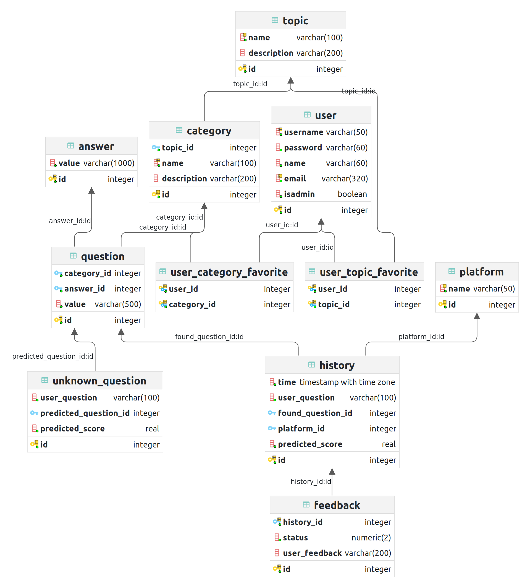
    <figcaption>Tabelas do banco de dados</figcaption>
</figure>

## Sistema Administrativo

<figure align="center">
    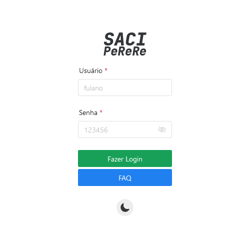
    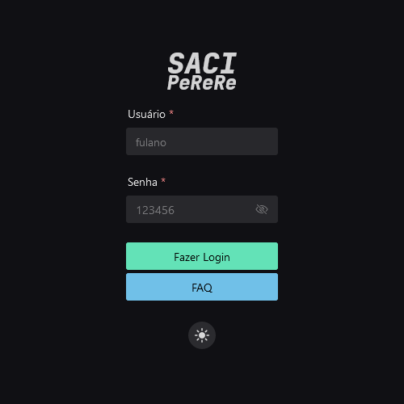
    <figcaption>Página de login</figcaption>
</figure>

<figure align="center">
    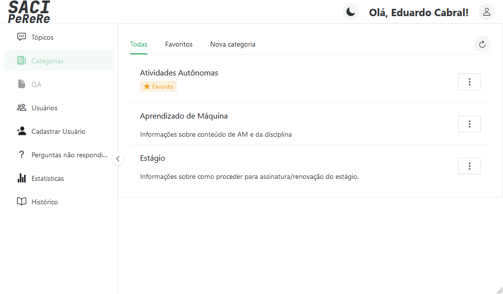
    <figcaption>Listagem de categorias</figcaption>
</figure>

<figure align="center">
    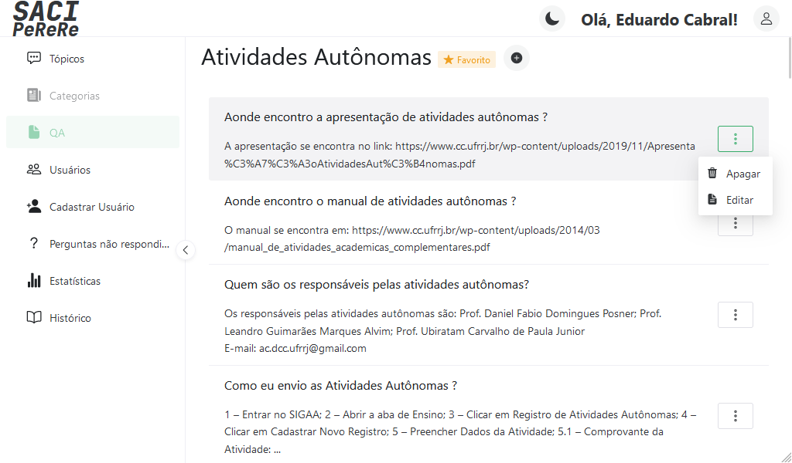
    <figcaption>Listagem de perguntas e respostas de uma categoria</figcaption>
</figure>

<figure align="center">
    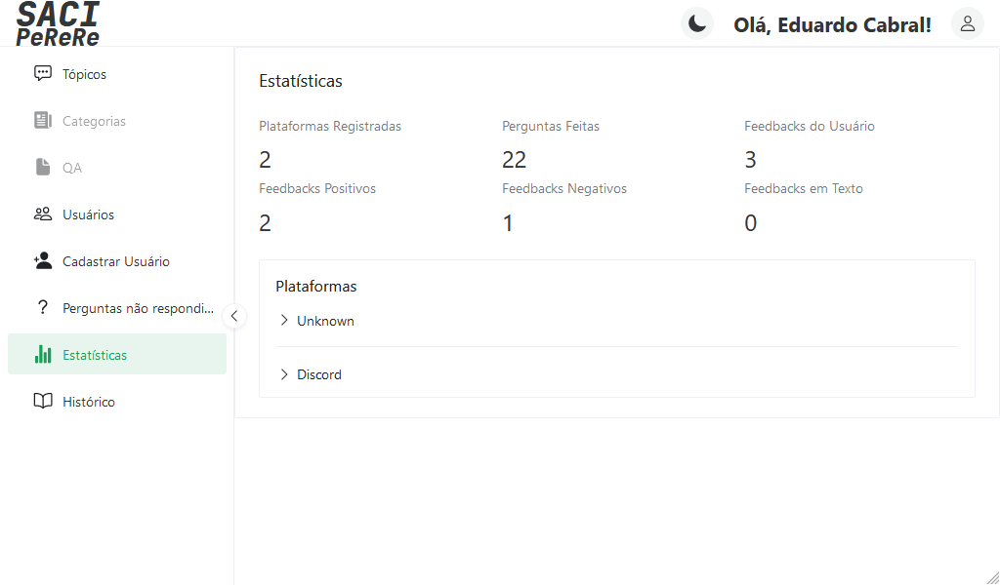
    <figcaption>Estatísticas de uso de plataformas</figcaption>
</figure>

<figure align="center">
    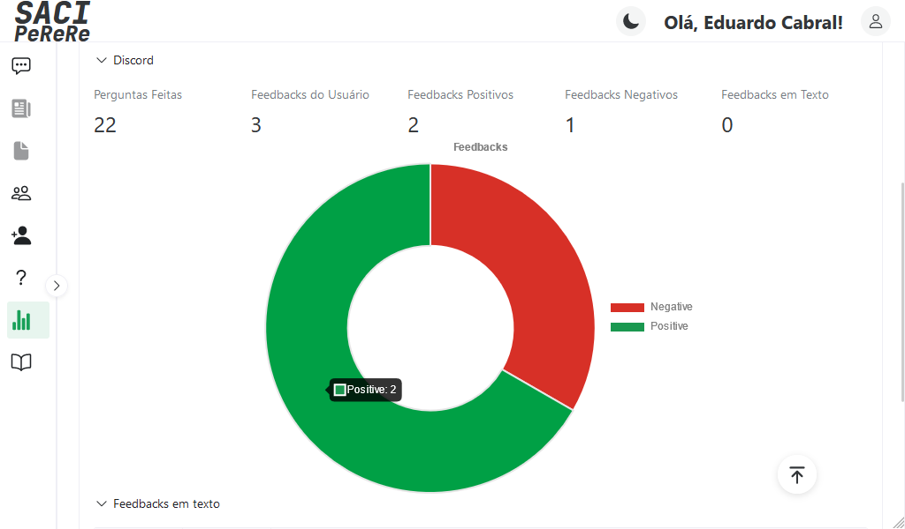
    <figcaption>Estatísticas de uso - Discord</figcaption>
</figure>

[Todas as imagens do sistema administrativo](./docs/sist-adm.md)

## Bot para Discord

<figure align="center">
    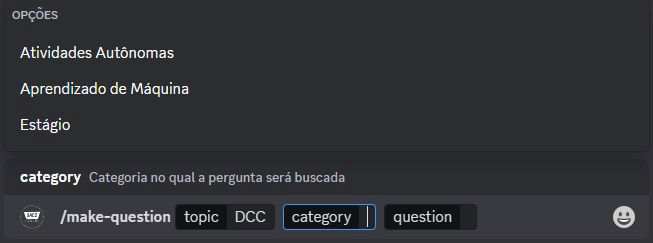
    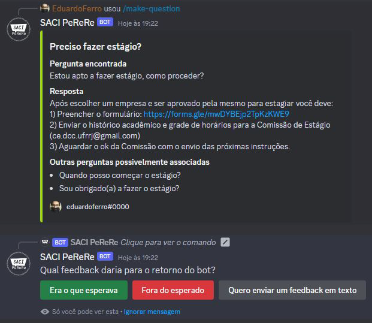
    <figcaption>Pergunta feita diretamente ao bot</figcaption>
</figure>

<figure align="center">
    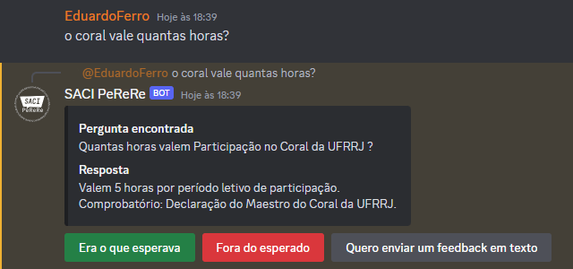
    <figcaption>Pergunta feita indiretamente ao bot</figcaption>
</figure>

## Relatório

> Exportar dados da plataforma

```json
[
  {
    "topic_id": 1,
    "topic_name": "DCC",
    "topic_description": null,
    "categories": [
      {
        "category_id": 1,
        "category_description": null,
        "category_name": "...",
        "topic_id": 1,
        "questions": [
          {
            "question_id": 8,
            "question": "...",
            "category_id": 1,
            "answers": [
              {
                "answer_id": 8,
                "answer": "..."
              }
            ]
          }
        ]
      }
    ]
  }
]
```
