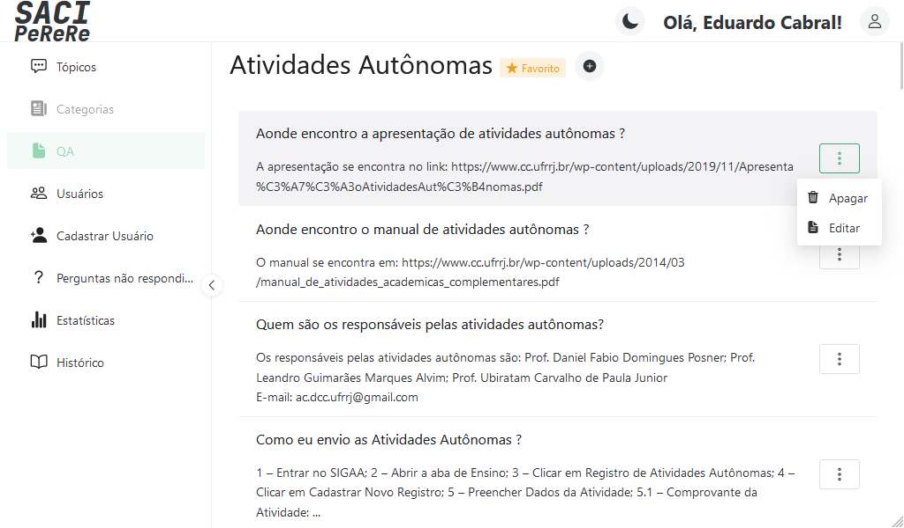
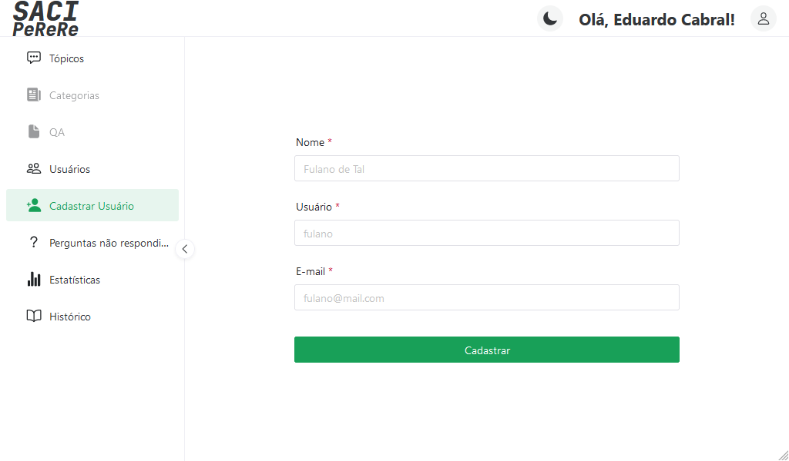
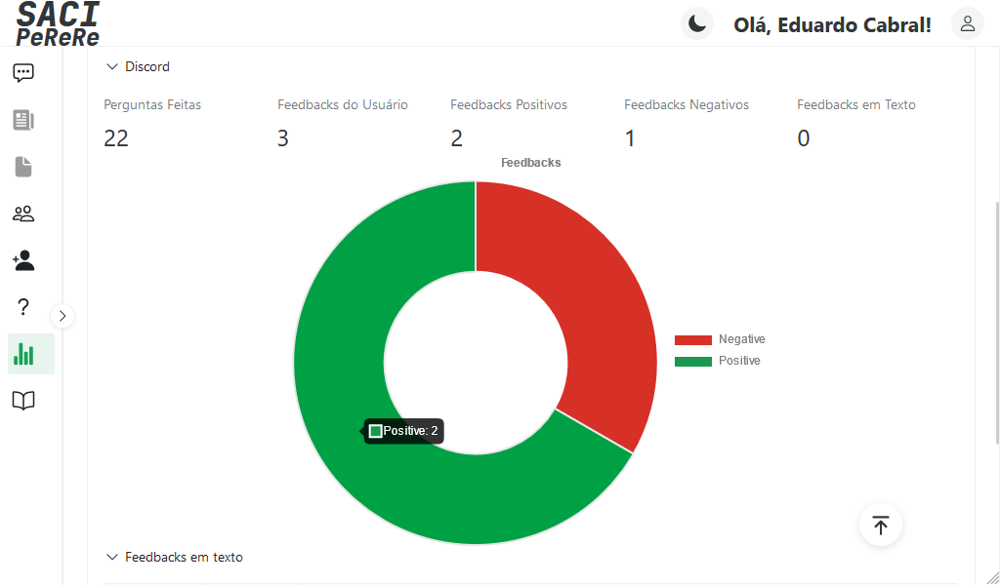

<figure align="center">
    
    
    <figcaption>Página de login</figcaption>
</figure>

<figure align="center">
    
    <figcaption>Listagem de tópicos</figcaption>
</figure>

<figure align="center">
    
    <figcaption>Edição de tópico</figcaption>
</figure>

<figure align="center">
    
    <figcaption>Listagem de categorias</figcaption>
</figure>

<figure align="center">
    
    <figcaption>Listagem de perguntas e respostas</figcaption>
</figure>

<figure align="center">
    
    <figcaption>Exibição de pergunta e resposta</figcaption>
</figure>

<figure align="center">
    
    <figcaption>Apagar pergunta e resposta</figcaption>
</figure>

<figure align="center">
    
    <figcaption>Editar pergunta e resposta</figcaption>
</figure>

<figure align="center">
    
    <figcaption>Criação de usuário</figcaption>
</figure>

<figure align="center">
    
    <figcaption>Histórico de perguntas</figcaption>
</figure>

<figure align="center">
    
    <figcaption>Perguntas não respondidas (score baixo)</figcaption>
</figure>

<figure align="center">
    
    <figcaption>Estatísticas de uso de plataformas</figcaption>
</figure>

<figure align="center">
    
    <figcaption>Estatísticas de uso - Discord</figcaption>
</figure>

